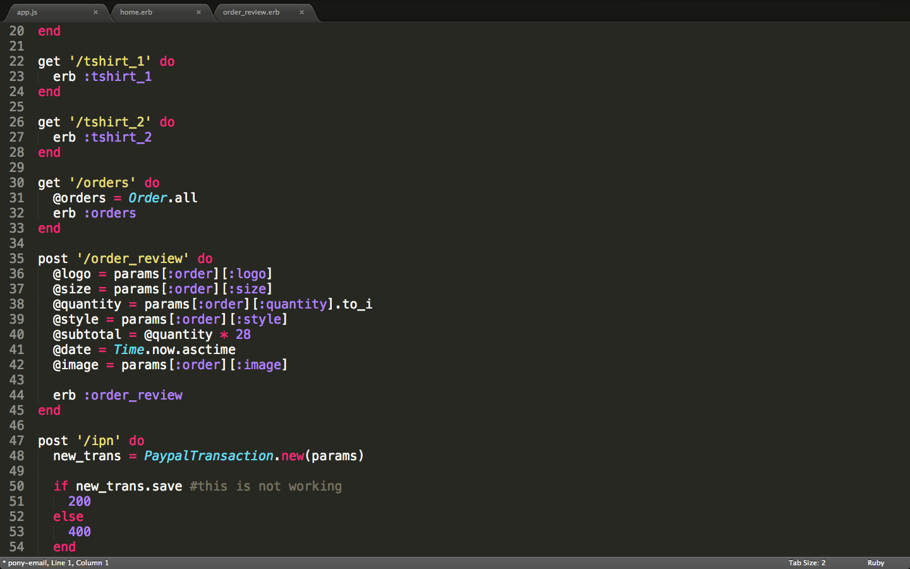
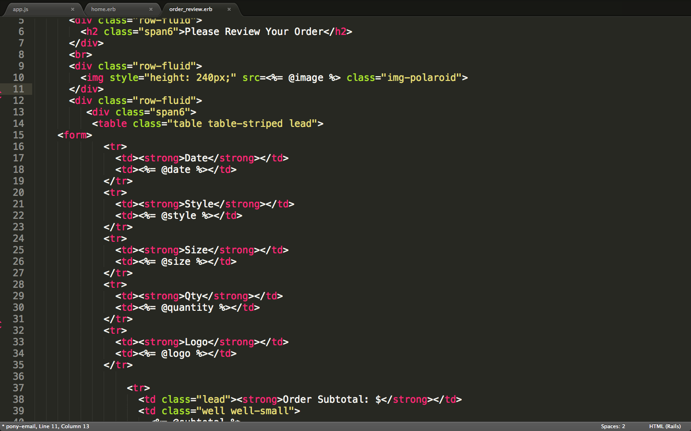
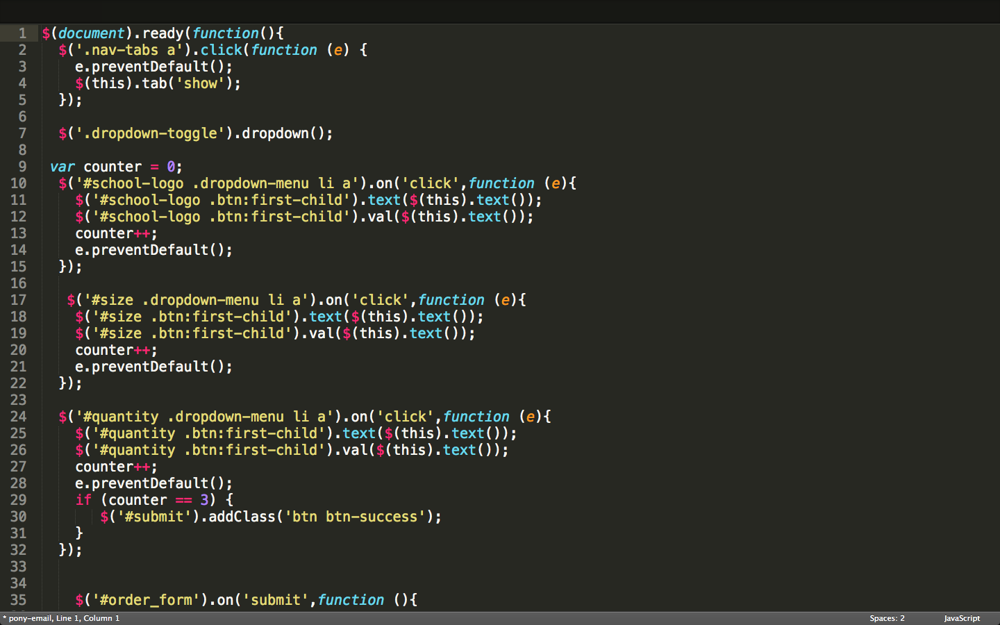
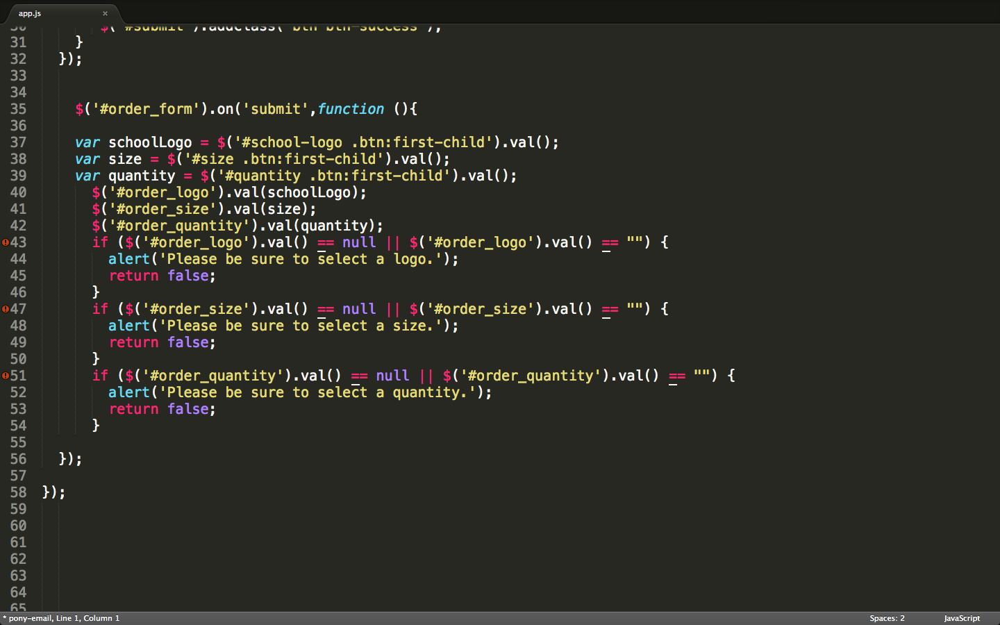
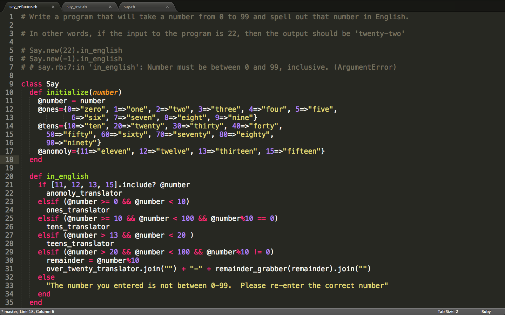
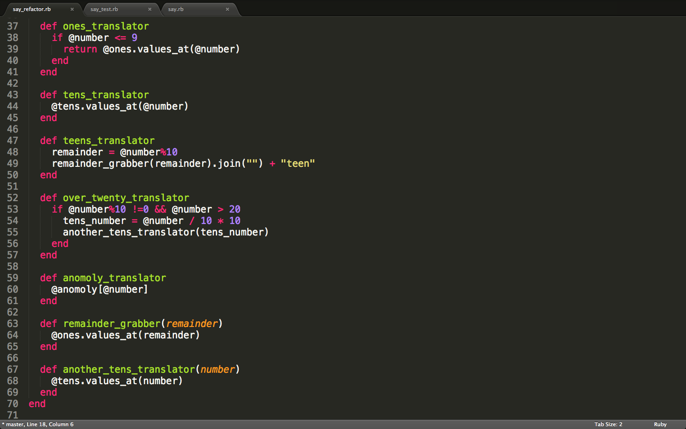
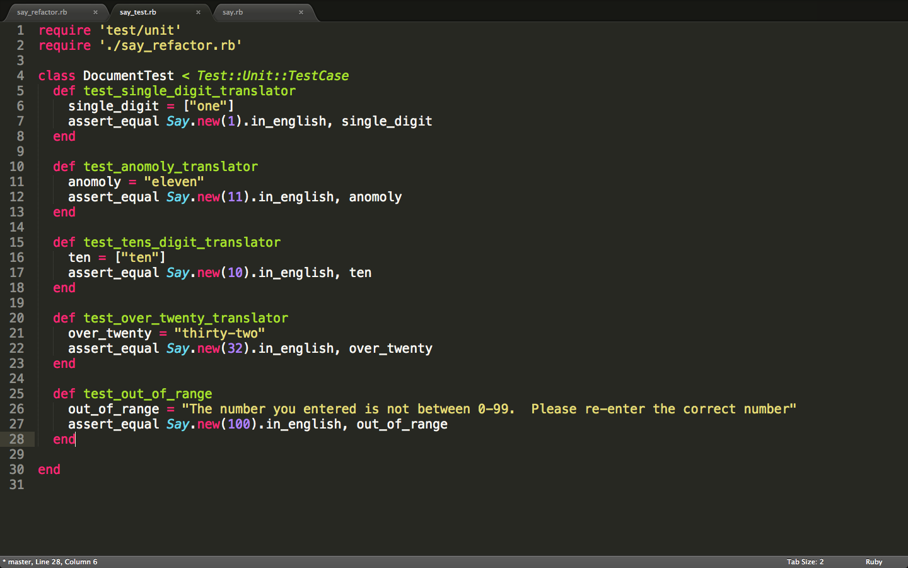



	<h3><a href="http://tranquil-temple-6555.herokuapp.com/">The Awesome Hoodie Project</a></h3>
  

  	I helped to re-construct a philanthropic web site designed to sell hooded sweatshirts.  A portion of the proceeds from each hoodie will be donated to local coding organizations focused on education and community events.
  

  
Below is some of the code for the site.

  <h4>The site was created using Sinatra.  Here's the App.rb file with routes...</h4>
  
  <h4>The order review page uses ERB...</h4>
  
  <h4>jQuery was used to enhance the user experience...</h4>
  
  <h4>more jQuery and JavaScript...</h4>
  
  <h3><a href="https://github.com/Hjack/kata">Programming Exercises</a></h3>
  

  	This is a collection of warm up exercises I do to enhance my programming abilities.  It's nothing major...just me practicing coding.
  

  
Below is a program I wrote in Ruby that takes a number and returns the number in English.  For example, passing the number "17", will return "seventeen".

   <h4>Created a Class for the program...</h4>
  
   <h4>Here are some of the functions I used...</h4>
  
   <h4>In true Ruby fashion, I included tests...</h4>
  

